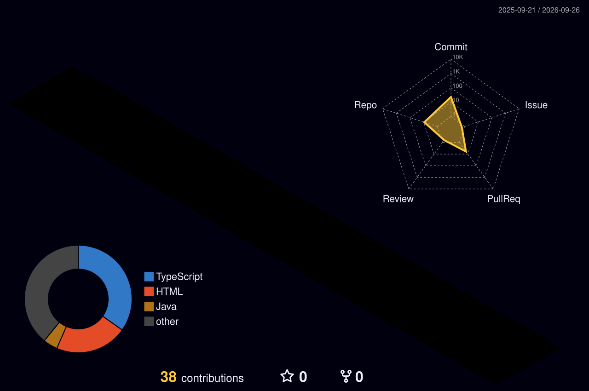
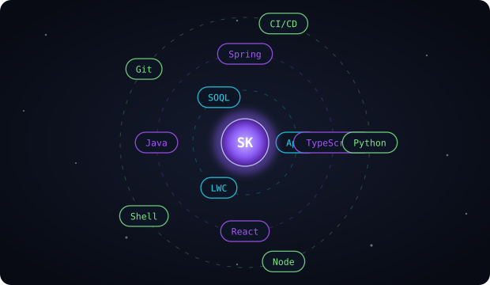

<!-- ═══════════════════════  ANIMATED HEADER  ═══════════════════════ -->

  
  
  

<!-- ═══════════════════════  THE CREW  ═══════════════════════ -->

  
  
  
  
  

<!-- ═══════════════════════  TERMINAL INTRO  ═══════════════════════ -->

<!-- ═══════════════════════  STATS  ·  HERO  ═══════════════════════ -->

<table>
<tr>
<td valign="top" width="55%">

#### i-saurav-kashyap's GitHub Stats

</td>
<td valign="top" width="45%">

</td>
</tr>
</table>

<!-- ═══════════════════════  IDENTITY  ·  COMMUNITY SIGNAL  ═══════════════════════ -->

<table>
<tr>
<td valign="top" width="50%">

#### i-saurav-kashyap

Developer building useful software

Building and sharing work in public.

**Featured repositories** · Public GitHub profile

**Company** · Independent builder

</td>
<td valign="top" width="50%">

#### Community signal

</td>
</tr>
</table>

<!-- ═══════════════════════  CONTRIBUTION ACTIVITY  ═══════════════════════ -->

## Contribution Activity

A year of commits, rendered three ways — regenerated automatically by GitHub Actions

<!-- 3D isometric calendar · .github/workflows/3d-contrib.yml -->
<picture>
  <source media="(prefers-color-scheme: dark)" srcset="profile-3d-contrib/profile-night-rainbow.svg" />
  <source media="(prefers-color-scheme: light)" srcset="profile-3d-contrib/profile-green-animate.svg" />
  
</picture>

<!-- Contribution snake · .github/workflows/snake.yml -->
<picture>
  <source media="(prefers-color-scheme: dark)" srcset="https://raw.githubusercontent.com/i-saurav-kashyap/i-saurav-kashyap/output/snake-dark.svg" />
  <source media="(prefers-color-scheme: light)" srcset="https://raw.githubusercontent.com/i-saurav-kashyap/i-saurav-kashyap/output/snake-light.svg" />
  
</picture>

<!-- ═══════════════════════  LANGUAGES · FRAMEWORKS · TOOLS  ═══════════════════════ -->

## Languages · Frameworks · Tools

  
  
  
  
  

  
  
  
  
  

  
  
  
  
  

<!-- ═══════════════════════  COMPETITIVE PROGRAMMING  ═══════════════════════ -->

## Competitive Programming

<!-- Swap the table above for real cards once you have handles:

-->

<!-- ═══════════════════════  FEATURED PROJECTS  ═══════════════════════ -->

## Featured Projects

<table>
<tr>
<td width="50%">
  
</td>
<td width="50%">
  
</td>
</tr>
<tr>
<td width="50%">
  
</td>
<td width="50%">
  
</td>
</tr>
</table>

<b>All public repositories</b>

 

| Repository | Language | What it is |
|:--|:--|:--|
| [salesforce-package](https://github.com/i-saurav-kashyap/salesforce-package) | HTML | Salesforce package scaffolding and deploy tooling |
| [waybill-automation](https://github.com/i-saurav-kashyap/waybill-automation) | Java | Spring Boot + OAuth2 waybill automation POC with a React/Vite front end |
| [salesforce-target-companies](https://github.com/i-saurav-kashyap/salesforce-target-companies) | HTML | Single self-contained HTML file, no build step |
| [Problem-Solving-Ability-Upgrade](https://github.com/i-saurav-kashyap/Problem-Solving-Ability-Upgrade) | — | Structured DSA practice log |
| [RepoMind-AI](https://github.com/i-saurav-kashyap/RepoMind-AI) | TypeScript | AI-assisted repository exploration |
| [Personal_Learning_Beacon](https://github.com/i-saurav-kashyap/Personal_Learning_Beacon) | TypeScript | Personal learning tracker |
| [saurav-kashyap](https://github.com/i-saurav-kashyap/saurav-kashyap) | HTML | Engineering portfolio — "Control Plane" design direction |
| [Salesforce_Learning](https://github.com/i-saurav-kashyap/Salesforce_Learning) | — | Salesforce study notes and samples |

<!-- ═══════════════════════  FOOTER  ═══════════════════════ -->

  
  
  

Public GitHub data · profile signal · built with hand-authored animated SVG

